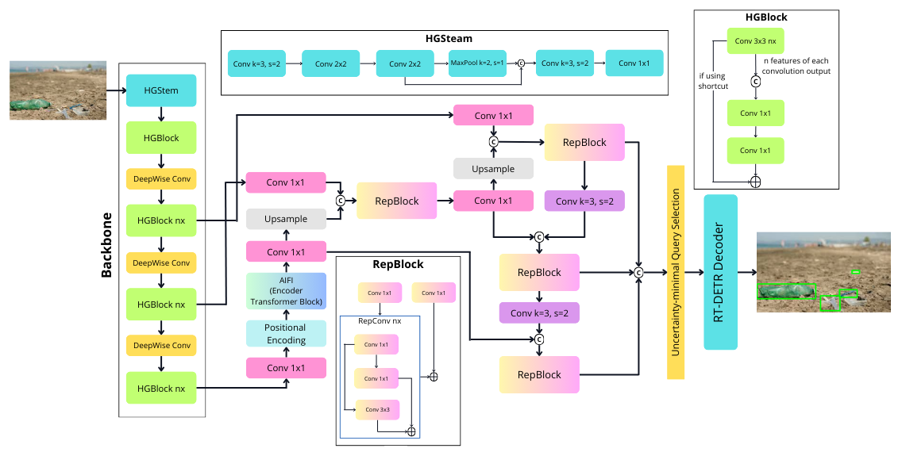

## RT-DETR Architecture

References: [arXiv](https://arxiv.org/abs/2304.08069) and [Ultralytics GitHub](https://github.com/ultralytics/ultralytics/tree/main/ultralytics/nn/modules).

## Dataset

The **plastic litter dataset** was obtained from [Roboflow Universe](https://universe.roboflow.com/monash-ventz/beach-waste-vqths), distributed under the [Creative Commons BY 4.0 license](https://creativecommons.org/licenses/by/4.0/).
RT-DETR was trained on **2,675 training images** with the following main categories of plastic waste:

* Bottle
* Clothes
* Metal
* Plastic
* Rope
* Styrofoam
* Wood

## Evaluation Results

The evaluation was carried out using **561 validation images**, excluding the wood and clothes categories.

| Class         | Images | Instances | Precision | Recall | mAP\@IoU\[50] | mAP\@IoU\[50-95] |
| ------------- | ------ | --------- | --------- | ------ | ------------- | ---------------- |
| **All**       | 561    | 2558      | 0.848     | 0.744  | 0.810         | 0.606            |
| **Bottle**    | 366    | 874       | 0.906     | 0.814  | 0.872         | 0.638            |
| **Metal**     | 228    | 458       | 0.882     | 0.852  | 0.878         | 0.648            |
| **Plastic**   | 331    | 603       | 0.838     | 0.776  | 0.819         | 0.636            |
| **Rope**      | 155    | 205       | 0.709     | 0.512  | 0.619         | 0.409            |
| **Styrofoam** | 195    | 418       | 0.904     | 0.765  | 0.861         | 0.697            |

## References

\[1] Monash, *Beach Waste Dataset*, Roboflow Universe, Oct. 2024. \[Online]. Available: [https://universe.roboflow.com/monash-ventz/beach-waste-vqths](https://universe.roboflow.com/monash-ventz/beach-waste-vqths). Accessed: Nov. 19, 2024.

\[2] Y. Zhao, W. Lv, S. Xu, J. Wei, G. Wang, Q. Dang, Y. Liu, and J. Chen, *DETRs Beat YOLOs on Real-time Object Detection*, arXiv preprint, 2024. \[Online]. Available: [https://arxiv.org/abs/2304.08069](https://arxiv.org/abs/2304.08069).

\[3] Ultralytics, *Ultralytics Neural Network Modules*, GitHub repository, 2024. \[Online]. Available: [https://github.com/ultralytics/ultralytics/tree/main/ultralytics/nn/modules](https://github.com/ultralytics/ultralytics/tree/main/ultralytics/nn/modules). Accessed: Dec. 1, 2024.

---

Do you want me to make this **more concise like a project report** or **more formal like a journal paper section**?
